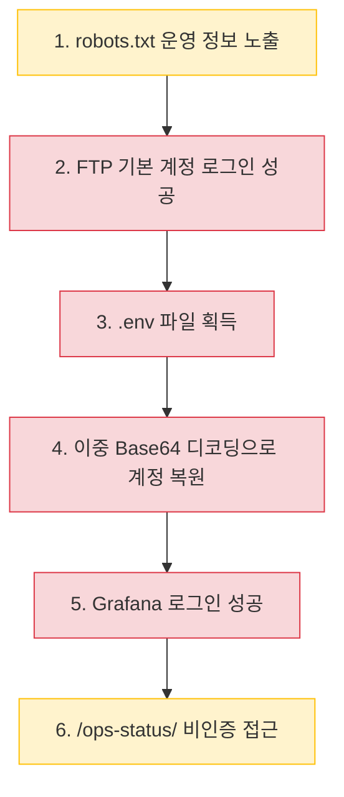

# target-info.md — 허용 대상 범위

`CLAUDE.md`의 §범위 제한(Rules of Engagement)이 참조하는 파일. 여기 명시된
호스트/URL 외에는 스캔·요청하지 않는다.

> **실제 대회/훈련 대상은 [`1TEAM-MEMORY`의 target-info.md](https://github.com/chhhd/1TEAM-MEMORY/blob/main/target-info.md)가
> 단일 진실 소스다.** 이 파일에 있는 것은 오케스트레이션 흐름/agent 정의를
> 개발·검증할 때 쓴 이 저장소 소유의 로컬 대상이다. Phase 1~4 게임을 실제로
> 진행할 때는 `1TEAM-MEMORY`쪽 "인가된 대상" 표를 기준으로 삼는다.

## 이 저장소의 허용 대상 (로컬 개발·검증용)

| 대상 | 용도 | 비고 |
|---|---|---|
| `http://127.0.0.1:5000` | `vulnapp/app.py` — 오케스트레이션 흐름 검증용 로컬 취약 앱 | `/search`, `/lookup`, `/user?id=`, `/admin`, `/upload`, `/fetch?url=` |
| `http://127.0.0.1:8080` | `dast-harness/targets/vulnerable_app/app.py` (submodule) — 스캐너/에이전트 정확도 검증용 통제 취약 타겟 | dast-harness 쪽 `ground_truth.json` 참고 |

## 실제 대회/훈련 대상 (1TEAM-MEMORY 인가 확인됨)

| 대상 | 용도 | 비고 |
|---|---|---|
| `43.200.51.235` (`ftp://` 21, `http://` 8081) | 외부 네트워크 점검 대상 — 1TEAM-MEMORY `target-info.md` 등재 인가 대상 | Phase 1(정찰)·Phase 2(수동 공격 체인) 결과는 §실제 점검 대상: `43.200.51.235` 참고. FTP 계정/Grafana 자격 증명은 마스킹된 형태로만 기록. |

## 원칙

- loopback(`127.0.0.1`/`localhost`) 또는 명시적으로 허가된 대상만 스캔한다
  (`dast_harness/safety.py`가 강제하는 것과 같은 경계).
- 이 표에 없는 새 대상을 추가하려면 이 파일을 먼저 갱신하고, 왜 필요한지
  커밋 메시지에 남긴다 — 대상 추가를 코드 변경과 같은 취급으로 리뷰한다.
- 실제 대회/훈련 대상이 정해지면 이 표에 행을 추가하되, 스코프를 넓히는
  변경이므로 팀 확인 후 반영한다.

---

## 실제 점검 대상: `43.200.51.235`

> **대상:** `43.200.51.235`
> **점검 일시:** 2026년 8월 18일
> **점검 위치:** 외부 네트워크
> **종합 위험도:** **높음(High)**

### 수행 업적

| **업적** | **상세** | **수행 방식** | **위험도** |
| --- | --- | --- | --- |
| FTP 계정 획득 | 외부 네트워크에서 기본 계정 조합을 통해 FTP 로그인 성공 | 수동 (도구 사용) | **High** |
| 환경설정 파일(.env) 획득 | FTP 서버 내 `.env` 파일을 다운로드하여 Base64 인코딩된 자격 증명 확인 | 수동 (도구 사용) | **High** |
| 암호화 문자열 복호화 | 이중 Base64 인코딩된 문자열을 디코딩하여 Grafana 계정 정보 복원 | 수동 (도구 사용) | **High** |
| Grafana 로그인 성공 | 복원된 계정으로 Grafana 로그인 후 HTTP 200 확인, 내부 모니터링 접근 | 수동 (도구 사용) | **Critical** |
| 운영 정보 비인증 접근 | `/ops-status/` 경로에서 인증 없이 내부 운영 보고서 3건 확인 | 수동 (도구 사용) | **Medium** |
| Grafana 버전 및 설정 정보 노출 확인 | 비인증 상태에서 Grafana 11.2.0 버전, 커밋 해시, DB 상태, 내부 URL 등 확인 | AI 에이전트 (스캐닝) | **Medium** |
| robots.txt 운영 메모 발견 | `robots.txt`에서 임시 Grafana 프록시 경로 및 운영 메모 확인 | AI 에이전트 (스캐닝) | **Low** |
| 평문 통신 확인 | HTTP/FTP 모두 암호화 미적용 상태, `AUTH TLS` 미지원 확인 | AI 에이전트 (스캐닝) | **Low** |

### 수행 이력

#### Phase 1. 초기 비파괴 정찰 (AI 에이전트)

> 🤖 **수행 방식:** AI 에이전트 자동 스캐닝

**1-1. 포트 스캐닝**

- TCP 상위 1,000개 포트 및 주요 UDP 포트 스캔 수행
- **결과:** `21/tcp`(FTP), `8081/tcp`(HTTP) 2개 포트 오픈 확인, 나머지 998개 포트 필터링 상태
- 전체 65,535개 포트 스캔은 제한 시간 내 미완료 → 고포트 영역 미확정 분류

```
nmap -sT --top-ports 1000 43.200.51.235
```

**1-2. 서비스 배너 확인**

- FTP 배너: `CJ internal file transfer` 노출
- HTTP 응답 헤더: `nginx/1.27.5` 확인

```
curl -I http://43.200.51.235:8081
```

**1-3. 공개 경로 조사**

- `robots.txt` 확인 → `/grafana/` 경로가 임시 프록시로 사용 중이라는 운영 메모 발견
- 해당 경로에서 Grafana 로그인 페이지 외부 접근 가능 확인

```
curl http://43.200.51.235:8081/robots.txt
```

**1-4. Grafana 정보 수집**

- 비인증 상태에서 수집한 정보:
  - Grafana 버전: `11.2.0` (지원 종료 구버전)
  - 전체 커밋 해시, 데이터베이스 상태
  - 내부 애플리케이션 URL
  - OSS 에디션 및 기능 설정

**1-5. FTP 초기 점검**

- 익명 로그인(`anonymous`) 시도 → **차단 확인**
- `AUTH TLS` 명령 → **미지원 확인** (평문 통신)

**1-6. 평문 통신 확인**

- 웹 서비스: HTTPS 미적용 (HTTP만 제공)
- FTP: TLS 미지원, 자격 증명 및 데이터 암호화 없음

#### Phase 2. 후속 공격 체인 검증 (수동)

> 🔧 **수행 방식:** 수동 도구 사용

**2-1. FTP 계정 로그인 시도**

- `robots.txt`에서 발견한 단서를 바탕으로 기본적인 계정 조합 시도
- **결과:** FTP 로그인 성공 응답 확인

```
ftp 43.200.51.235
```

**2-2. FTP 서버 내 파일 탐색**

- FTP 접속 후 디렉토리 탐색 수행
- **결과:** `.env` 환경설정 파일 발견

```
ls -la
get .env
```

**2-3. .env 파일 분석 및 Base64 디코딩**

- `.env` 파일 내부에 Base64 인코딩된 문자열 확인
- 이중 Base64 디코딩 수행 → Grafana 계정 정보(사용자명/비밀번호) 복원

```
echo "<encoded_string>" | base64 -d | base64 -d
```

> 🔐 **획득한 자격 증명 (마스킹 처리)**
> - 사용자명: `ops-******`
> - 비밀번호: `N0*********!`

**2-4. Grafana 로그인 검증**

- 복원된 계정으로 Grafana 로그인 시도
- **결과:** HTTP 200 응답, 로그인 성공 확인
- 내부 모니터링 대시보드 접근 가능 상태

```
curl -X POST http://43.200.51.235:8081/grafana/login -d '{"user":"ops-******","password":"N0*********!"}'
```

**2-5. 추가 비인증 경로 탐색**

- `/ops-status/` 경로 접근 시도
- **결과:** 인증 없이 HTTP 200 응답, 내부 운영 보고서 3건 노출 확인
- 가동 상태 보고서, 장애 사후 분석, 용량 계획 문서

```
curl http://43.200.51.235:8081/ops-status/
```

### 공격 체인 요약



### 발견 사항 요약

| **ID** | **항목** | **위험도** | **발견 방식** |
| --- | --- | --- | --- |
| F-01 | FTP 기본 계정 활성화 → 로그인 성공 | **High** | 수동 |
| F-02 | FTP 서버 내 `.env` 파일 노출 | **High** | 수동 |
| F-03 | Base64 인코딩된 자격 증명 → Grafana 로그인 성공 | **Critical** | 수동 |
| F-04 | `/ops-status/` 비인증 접근, 운영 문서 3건 노출 | **Medium** | 수동 |
| F-05 | Grafana 11.2.0 (지원 종료), nginx 1.27.5 버전 노출 | **Medium** | 에이전트 |
| F-06 | HTTP/FTP 평문 통신 (암호화 미적용) | **Medium** | 에이전트 |
